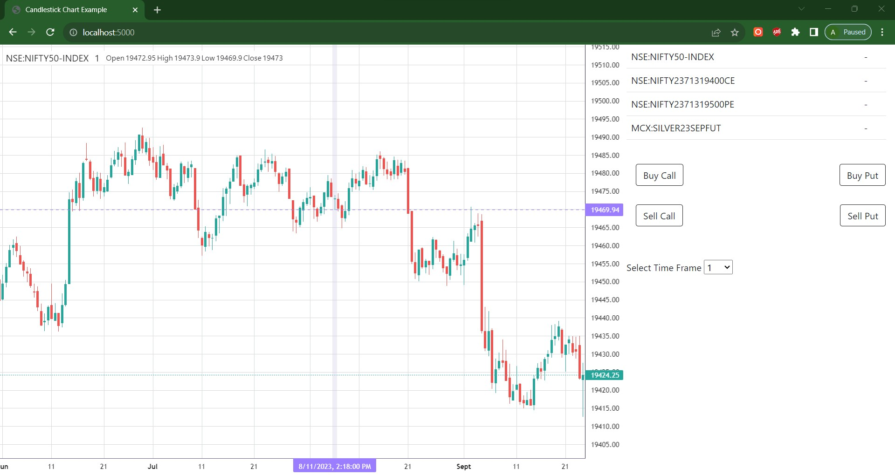

# Simple GUI and Charting for Semi-Algo Trading

This project aims to provide a user-friendly Graphical User Interface (GUI) for semi-automated trading, along with charting capabilities to aid in decision-making. The application is designed to assist traders in executing their trading strategies by combining human intuition with algorithmic assistance.

## Table of Contents

- [Features](#features)
- [Installation](#installation)
- [Usage](#usage)
- [Screenshots](#screenshots)
- [Technologies Used](#technologies-used)
- [Contributing](#contributing)
- [License](#license)

## Features

1. **Manual Trading**: Execute manual trades through the GUI with a click of a button.
2. **Algorithm Integration**: Integrate your custom trading algorithms for semi-automated trading.
3. **Risk Management**: Set stop-loss and take-profit levels to manage trading risk.

## Installation

1. Clone the repository:
   ```
   git clone https://github.com/adi1611/AlgoTradeGUI.git
   cd AlgoTradeGUI
   ```


2. Configure API keys: Fill your API keys into UserInfo.py file for data retrieval.

## Usage

1. Run the application:
   ```
   python main.py
   ```

2. Log in with your credentials.

3. Navigate to the "Trading" section to execute manual trades and monitor algorithmic strategies.


## Screenshots


*Market Data and Charts*


## Technologies Used

- Python
- Lightweight Charts (GUI toolkit)
- Matplotlib (Charting library)
- Pandas (Data manipulation)
- Fyers API

## Contributing

Contributions are welcome! If you'd like to contribute, please fork the repository and create a pull request.

## License

This project is licensed under the [GNU GENERAL PUBLIC LICENSE](LICENSE).

---

**Disclaimer:** This is an incomplete project please use it at your risk.This project provides a basic framework for semi-automated trading. Trading involves significant risk and it's important to conduct thorough research and seek professional advice before making trading decisions. The authors of this project are not responsible for any financial losses incurred.
